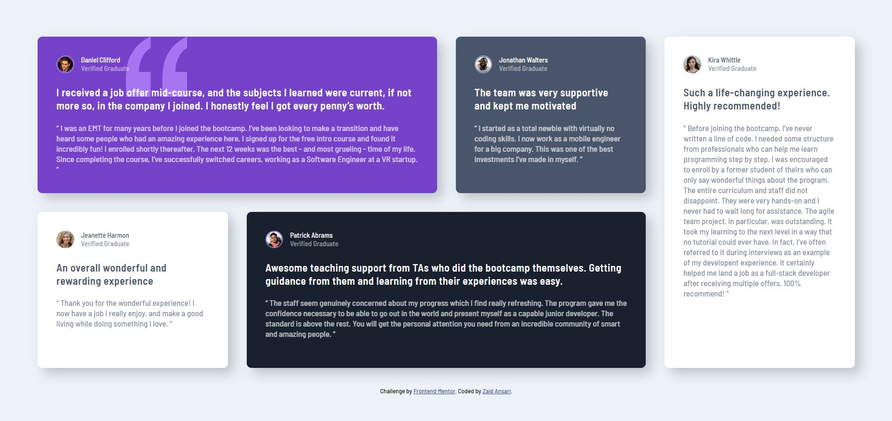

# Frontend Mentor - Testimonials grid section solution

This is a solution to the [Testimonials grid section challenge on Frontend Mentor](https://www.frontendmentor.io/challenges/testimonials-grid-section-Nnw6J7Un7). Frontend Mentor challenges help you improve your coding skills by building realistic projects.

## Table of contents

- [Overview](#overview)
  - [The challenge](#the-challenge)
  - [Screenshot](#screenshot)
  - [Links](#links)
- [My process](#my-process)
  - [Built with](#built-with)
  - [What I learned](#what-i-learned)
- [Author](#author)

## Overview

### The challenge

Users should be able to:

- View the optimal layout for the site depending on their device's screen size

### Screenshot



### Links

- Solution URL: [Add solution URL here](https://your-solution-url.com)
- Live Site URL: [Add live site URL here](https://your-live-site-url.com)

## My process

### Built with

- Semantic HTML5 markup
- CSS custom properties
- Flexbox
- CSS Grid
- Mobile-first workflow

### What I learned

I learned how CSS Grid comes very much handy in positioning the sections and applying the styles, either if we want a different one. Or want to repeat the same style. and even while building a responsive one, it removes the hassles.

```html
<blockquote>An overall wonderful and rewarding experience</blockquote>
```

```css
section.grid:nth-child(3),
section.grid:nth-child(5) {
  background-color: var(--White);
  color: var(--Very_dark_grayish_blue);
}
```

## Author

- Website - [Add your name here](https://www.your-site.com)
- Frontend Mentor - [@zaidansari42](https://www.frontendmentor.io/profile/zaidansari42)
- Twitter - [@zaidansari42](https://www.twitter.com/zaidansari42)
